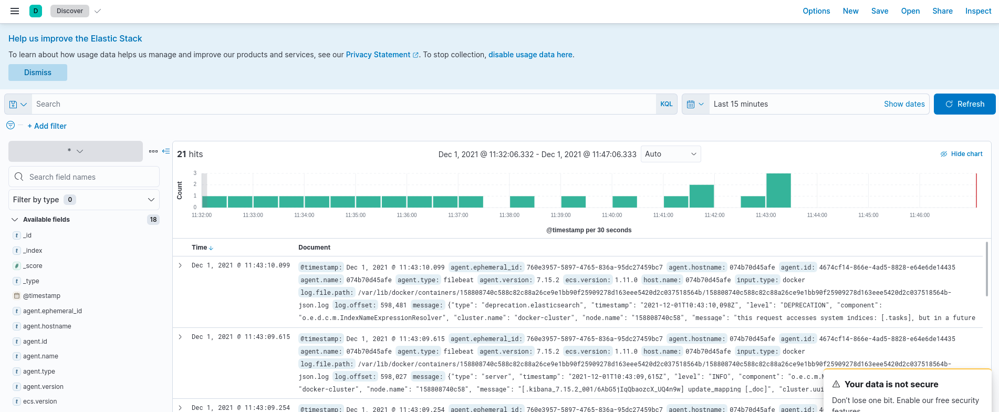

Nassim KHIRREDINE
Marouane AZZOUZ


We worked with Hugo Venancio but wrote this file separately.

# TP 1 - Prometheus & Grafana

`1. What's the difference between the system CPU usage and the process CPU usage ?`
System CPU usage = CPU usage of the whole system
Process CPU usage = CPU usage of the JVM

`2. What represents the CPU load ?`
CPU load is the number of processes which are being executed by CPU or waiting to be executed by CPU.

`3.4. What are all those types of thread ? What do they all mean ?`

- **runnable :** Runnable is an interface which represents a task that could be executed by either a Thread or Executor or some similar means.
- **blocked :** A thread that is blocked waiting for a monitor lock is in this state.
- **waiting :** A thread that is waiting indefinitely for another thread to perform a particular action is in this state
- **time-waiting :** A thread lies in timed waiting state when it calls a method with a time out parameter.
- **new :** Used to begin the execution of thread

`5.Memory max / used / committed ?`

- **Max :** max amount of memory is allowed for the JVM to be used
- **Used :** amount of memory used by the JVM
- **Commit :** 'The amount of memory in bytes that is committed for the Java virtual machine to use' -> reserved memory for the JVM

# TP 2 - Elastic stack

1. Which exporter did you use ? Describe your configuration.
   - We used [elasticsearch_exporter](https://github.com/prometheus-community/elasticsearch_exporter)

```yml
version: "3.3"
services:
  elasticsearch:
    container_name: elasticsearch
    image: docker.elastic.co/elasticsearch/elasticsearch:7.15.2
    environment:
      - discovery.type=single-node
    ports:
      - "9200:9200"
      - "9300:9300"
    networks:
      - resa-network

  prom:
    container_name: prom
    image: prom/prometheus
    ports:
      - "9090:9090"
    volumes:
      - ./prometheus.yml:/etc/prometheus/prometheus.yml
    networks:
      - resa-network

  kibana:
    container_name: kibana
    image: docker.elastic.co/kibana/kibana:7.15.2
    ports:
      - 5601:5601
    networks:
      - resa-network
    environment:
      - ELASTICSEARCH_HOSTS=http://elasticsearch:9200

  elasticsearch_exporter:
    container_name: elasticsearch_exporter
    image: quay.io/prometheuscommunity/elasticsearch-exporter:latest
    command:
      - "--es.uri=http://elasticsearch:9200"
    restart: always
    ports:
      - "127.0.0.1:9114:9114"
    networks:
      - resa-network
    depends_on:
      - elasticsearch

networks:
  resa-network:
```

2. List the existing Beats in the Elastic world, and explain in 1-2 lines what data it is supposed to collect.

   - List
     - Filebeat
     - Metricbeat
     - Packetbeat
     - Winlogbeat
     - Auditbeat
     - Heartbeat
     - Functionbeat
   - Transfer agent ("shippers") used to transfer data with multiple different beats, each handle a different type of data.

3. List the steps you followed and the command you run in order to set up Filebeat.

- Here's the config used to run and set up filebeat

- In a directory name *filebeat/* :
```Dockerfile
#Dockerfile used to bypass permission errors on filebeat.yml
FROM docker.elastic.co/beats/filebeat:7.15.2
COPY ./filebeat.yml /usr/share/filebeat/filebeat.yml
USER root
RUN chown root:filebeat /usr/share/filebeat/filebeat.yml
USER filebeat
```

```yml
# filebeat.yml
output.elasticsearch:
  hosts: ["http://elasticsearch:9200"]
filebeat.inputs:
- type: docker
  containers.ids: '*'

```

- docker-compose at root working directory

```yml
#docker-compose.yml : filebeat container configuration
filebeat:
  container_name: filebeat
  build: ./filebeat # to build with Dockerfile 
  volumes:
    - /var/lib/docker/containers:/var/lib/docker/containers:ro
  user: root # user root because of permission errors (just in case)
  networks:
    - resa-network
  depends_on:
    - elasticsearch
    - kibana
    - elasticsearch_exporter
```

4. Checkpoint : validate your setup with us and document your work


5. Explain how you managed to detect the problem, and how you fixed it or tried to fix it !
  - After testing a few endpoints, they seem to work just fine. We weren't able to find a bug.
  - After reflexion, we actually found out thanks to another group that we used the wrong application (sample-app from last year) instead of the leaked version of reservation-app. We will come back to this part and update it with the right application running if we have time.

6. Configure the Filebeat autodiscover. Checkpoint

- No time to do this part right now. Will come back here later if time allows it.


# TP3 - Load tests

1. What are those parameters used for ?
- These parameters are loaded in the scala file via a .env file. 
  - **GATLING_RAMP_USERS** : Injects a given number of users distributed evenly on a time window of a given duration
  - **GATLING_TARGET_URL** : the url to target for testing ()
  - **GATLING_RAMP_DURATION** : duration for the even distribution of users

2. Why are the results improving with the number of times I run the tests ?
- Because of the cache that is generated after the first requests

3. What can companies do to both absorb those previsible spikes while limiting their costs ?
- Companies can buy servers or increase their capacity in prevision of those spikes.
  - This would be a bit of a waste since the money spent would be worth it only during those spikes, so what they could do instead is **rent** some servers.


4. What is the difference between "limits" and "reservations" ?
- **revervations :**  dedicated resources from the host, always available for the container
- **limits :** prevents the container/binary from exceeding the resources set in here. (even though there could be more resources allocated)

5. Explain what those two parameters are used for.

- **Xmx :** maximum memory allocation pool for a JVM 
- **Xms :** initial memory allocation pool
- The JVM will start with **Xms** amount of memory and will be able to use **Xmx** amount of memory.

6. Explain what is a N+1 problem. Why is it happening in our case ?
- N+1 problem is when you have to make N additional requests to fetch data that could have been fetched. 

7. What is EAGER fetchtype ? What's the difference with LAZY fetchtype ?
- **EAGER :** fetching data immediately 
- **LAZY :**  fetching data when needed